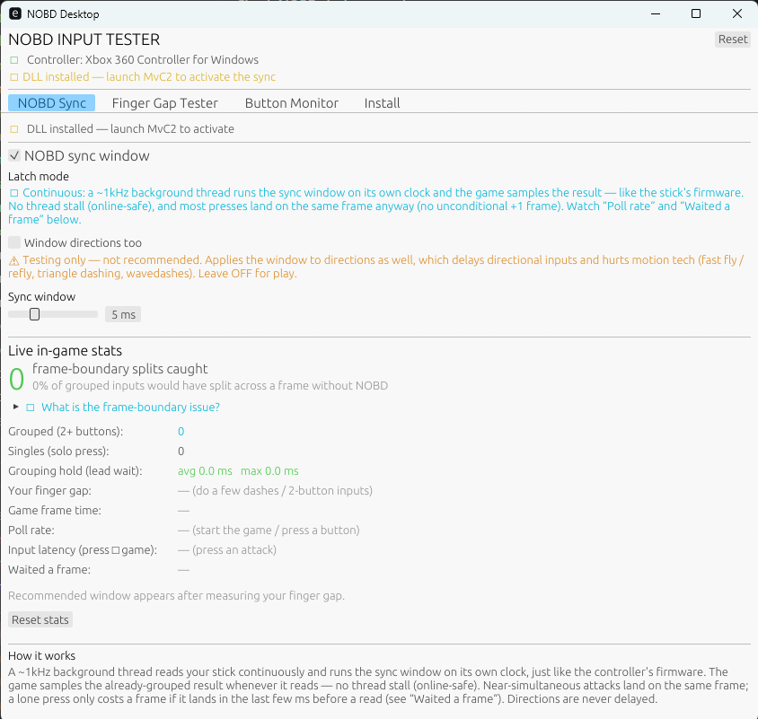

# NOBD Desktop

> ### NOBD keeps your inputs honest and your intent intact.
> **Execution is back. No more fighting a broken pipeline between your hands and the game.**

Frame-sync for the PC version of *Marvel vs. Capcom 2* (Fighting Collection, Steam). Your stick updates at 1000 Hz; the game reads at 60. NOBD groups your near-simultaneous attack presses so they land on the **same game frame** — your dash is a dash, not a stray jab — no NOBD stick required. It brings the [GP2040-CE NOBD](https://github.com/t3chnicallyinclined/GP2040-CE-NOBD) sync window to PC, in software.

<!-- Hero shot: the one screen, sync working -->


> 📖 **New here?** See the [**Usage Guide**](docs/USAGE.md) — a page-by-page walkthrough (Install, NOBD Sync, and the Finger Gap Tester, including how to read it and pick your window).

> ## ⚡ You're using the free fix. There's a board coming.
>
> NOBD Desktop is the sync window in software. It is also built into **the most over-engineered fightstick PCB ever designed**: dual MCU, up to 16 kHz USB, native retro consoles, a 40x-faster LAN target, fully open. Pre-prototype, built in public.
>
> **The Founding 100 is open: the first 100 reservations lock $150 (retail lands at $199).** No payment now, nothing binding. Show support, or are you just insane enough to want the fastest, most over-engineered fightstick ever made? **[Reserve yours at zero.nobd.net/build →](https://zero.nobd.net/build?utm_source=nobd-desktop-repo&utm_medium=repo)**

---

## The problem it fixes

Old arcade/console games like MvC2 read your controller **once per frame — 60 times a second, every 16.67 ms** — locked to the original hardware's refresh. On that hardware the controller and the game's read were tightly coupled, so two buttons pressed "together" always landed together.

On modern hardware (and emulation) your controller updates far faster (1000 Hz+) than the game still reads (60 Hz). When you press two buttons a few ms apart — your natural **finger gap** — the game's single 60 Hz read can land **between** them and see only the first button. A dash becomes a stray jab, an assist drops, a tech is missed. Not because you mis-input — because the read sampled at the wrong instant.

NOBD Desktop watches the game's input read: when it catches a lone attack, it checks whether the partner is arriving and delivers them together.

**It's not your execution — it's the read. NOBD fixes the read.**

---

## How it works

NOBD runs **inside the game**. Marvel already loads `DINPUT8.dll`, so NOBD ships
a drop-in replacement that forwards everything to the real one and, on the way
past, groups your near-simultaneous attack presses. Nothing is injected, no
driver is installed, and no extra controller appears anywhere.

```
   your stick  ──▶  the game reads it  ──▶  NOBD groups the presses  ──▶  the game
                                            (a few instructions, in-path)
```

Because it works on the **game's** side of the boundary rather than the device's,
it does not care what your stick is:

| your stick | how the game sees it | covered |
|---|---|---|
| Xbox / XInput pad | `XInputGetState` | yes |
| DirectInput stick | `GetDeviceState` | yes |
| PS4 / PS5 pad | Steam Input presents an Xbox pad | yes |

No mode switch, no hiding your stick, no picking a device in-game.

A background ~1 kHz thread runs the sync window on its own fine clock, exactly
like the controller firmware; the game's read samples the already-committed
result and **never waits on us**. That matters for online: NOBD changes the
inputs the game reads *before* it captures them for the frame, so both clients
serialise and simulate the same inputs — the same thing a hardware NOBD stick
does. It never stalls the game thread.

### The contract

NOBD changes **when** an edge reports. It never changes **which** buttons report,
and never **how long** you held them.

- A press is held for at most the window, and is delivered early the moment two
  attacks are held — nothing left to wait for, so no added delay.
- **A press is never deleted.** A tap shorter than the window still lands.
- **Pulse width is preserved.** A release is delayed by the same amount its press
  was, so a 40 ms hold reaches the game as a 40 ms hold.

The same window runs in the app, the Linux daemon (`nobdd`) and the UMDF HID
filter from one implementation (`shared/src/sync_window.rs`), covered by 18 tests
plus a C++ parity suite.

---

## Install / Use

1. Download **`NOBD-Desktop-Setup-x.y.z.exe`** and run it.
2. Open NOBD. It finds Marvel and installs itself into the game folder — no admin
   prompt, nothing to configure.
3. Launch Marvel and play.

The app shows whether NOBD is in the game and whether it is working right now.
Press two punches together and it tells you how many landed together, how far
apart your fingers actually were, and how many would have split across a frame
without it.

**Removing it:** uninstall *NOBD Desktop* from Add/Remove Programs.

---

## What the numbers mean

While you play, everything is measured **inside the game**, where NOBD can see
the game's real read cadence.

| Number | What it means |
|---|---|
| **dashes landed** | Two-button presses delivered in one report. The game cannot split these — the risk is exactly zero, at any timing. |
| **dropped** | Two-button presses that did not land together. If this climbs, the window is tighter than your hands, and the app offers you a wider one. |
| **saved by NOBD** | How many would have split across a 60 Hz frame unaided. |
| **your fingers, apart** | Your raw gap, measured before the window touches it. |

The event log shows each press as *what your hands did → what the game got*, with
the odds a 60 Hz game splits it — *about 1 in 5* rather than a percentage. Where
the answer is certain it says so: *always safe*, or *drops every time*.

---

## Build from source

Requires the [Rust toolchain](https://rustup.rs) (MSVC, x64).

```sh
cargo build --release
# app  → target/release/nobd.exe
```

Workspace layout:

| Crate | Output | Role |
|-------|--------|------|
| `app/` | `nobd.exe` | Tray control panel + finger-gap tester (egui) |
| `shared/` | lib | The shared-memory config/stats struct, mapped by both |

---

## Credits

- Sync-window concept from **[GP2040-CE NOBD](https://github.com/t3chnicallyinclined/GP2040-CE-NOBD)** firmware.
- Finger-gap tester UI adapted from the **NOBD Finger Gap Tester**.
- Inline hooking via [`retour`](https://crates.io/crates/retour); UI via [`egui`/`eframe`](https://github.com/emilk/egui).

## License

MIT — see [LICENSE](LICENSE).
