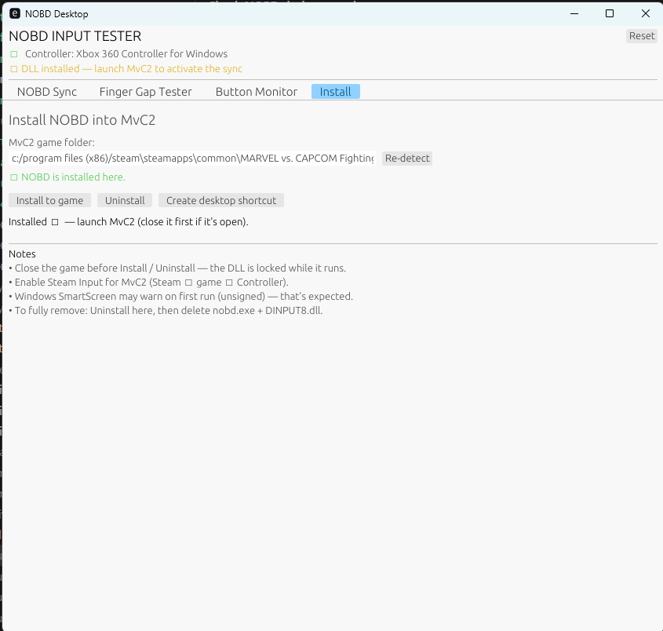
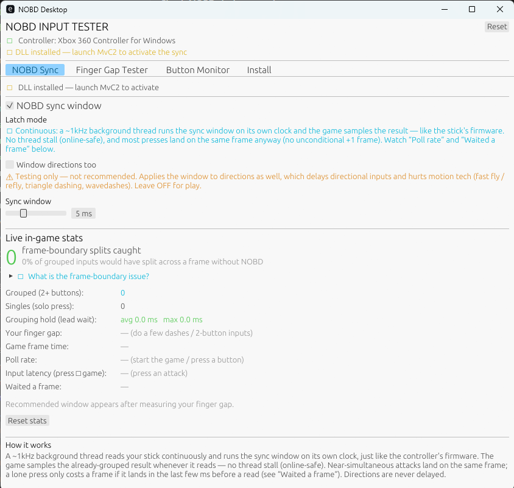
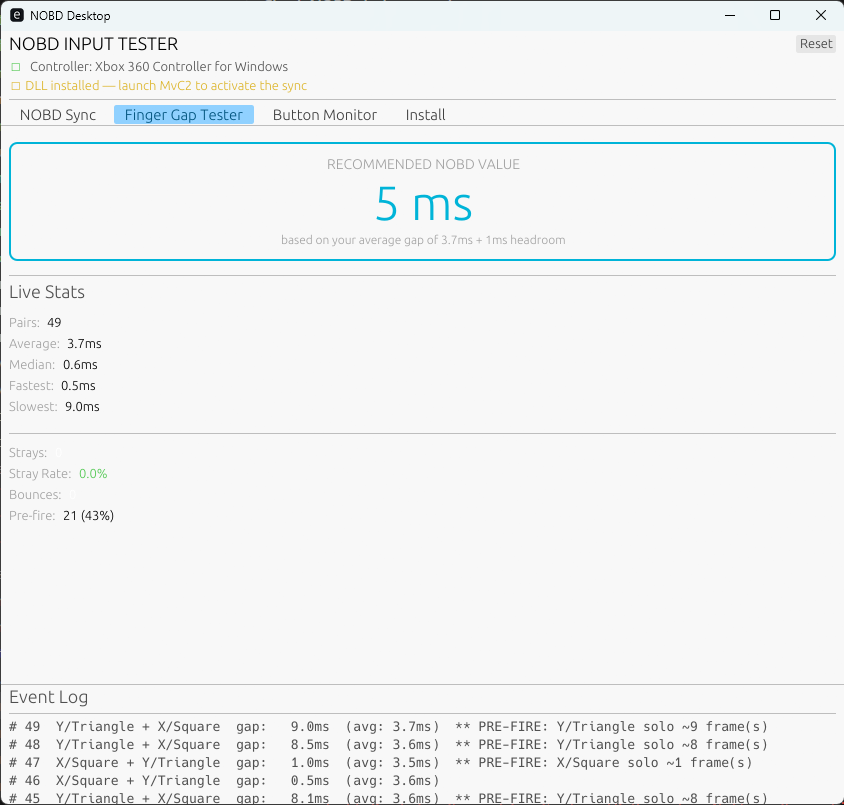

# Using NOBD Desktop

A walkthrough of each page in `nobd.exe`. New here? Do them in this order:
**Install → Finger Gap Tester → NOBD Sync.**

---

## 1. Install page — get the hook into the game

This copies `DINPUT8.dll` into your MvC2 folder so it loads with the game.

1. **Game folder** — auto-detected from your Steam library. If it's blank or
   wrong, click **Re-detect**, or paste the path to the folder that contains
   `MarvelVsCapcomFightingCollection.exe`.
2. The status line tells you where you stand:
   - 🟡 *No game folder set* / *that folder doesn't contain the MvC2 exe*
   - 🔵 *Game found — ready to install*
   - 🟢 *NOBD is installed here*
3. **Install to game** — copies the DLL in. **Close MvC2 first** (the DLL is
   locked while the game runs).
4. **Uninstall** — removes the DLL from the game folder.
5. **Create desktop shortcut** — drops a "NOBD Desktop" icon so you can relaunch
   the tray app after closing it.

Once installed, the DLL loads **automatically every time you launch MvC2** — you
don't reinstall each session. If you install while the game is already open,
restart the game once. `nobd.exe` itself is just the control panel; the sync
works even with the app closed.

> **Steam Input** must be enabled for MvC2 (Steam → game → Properties →
> Controller), since that's what presents your stick as the Xbox pad the game
> reads. Unsigned build, so Windows SmartScreen may warn on first run.

---

## 2. NOBD Sync page — the live control + stats

The banner at the top shows hook status: 🔴 *DLL not installed* → 🟡 *installed,
launch MvC2* → 🟢 *In-game hook LIVE*.

**Controls**

- **NOBD sync window** (master checkbox) — turns the sync on/off. With it
  **off**, the app doesn't stop working — it switches to a **passive monitor**
  that counts the dashes the game splits *without* help (see below).
- **Sync window** (slider, 1–16 ms) — how long a lead attack waits for its
  partner before being delivered. This is the one knob that matters; set it from
  the Finger Gap Tester (next section). Default 5 ms.
- **Window directions too** — testing only. Applies the window to directions as
  well, which delays motion inputs (fast fly/refly, triangle dashing,
  wavedashes). **Leave off for play.**

Mode is **Continuous** (a ~1 kHz background thread runs the window on its own
clock; the game samples the result). It's the only mode — non-blocking
(online-safe) and low-latency.

**Reading the stats** — full reference in the
[main README](../README.md#stats-explained). Quick version:

- **Sync ON** → green headline *"frame-boundary splits caught"* (saves), plus
  poll rate, true input latency, "waited a frame" cost, grouping, finger gap,
  frame time, and a recommended window.
- **Sync OFF** → red headline *"frame-boundary splits MISSED"* — the passive
  monitor counts how many of your gapped two-button inputs the game actually
  split across a frame.

Flip **OFF → play a set → ON → play a set** for a direct before/after. The top
**Reset** button clears all stats (do it at a menu — they climb back instantly
while you're playing).

---

## 3. Finger Gap Tester — measure your timing & pick a window

### Why it's useful

The sync window only works well if it matches **your** finger gap — the real
time between the two buttons when you press them "together":

- **Window too small** → your slower dashes still fall outside it and split.
- **Window too large** → you hold lead presses longer than needed, adding
  latency for no benefit.

The tester measures your actual gap (reading the pad **directly** — it works
with or without the game running) so you can set the window to the sweet spot:
**just above your typical/slowest pair.**

**How to use it:** press two attack buttons at the same time, like an LP+HP dash,
over and over (10–20 reps). Each pair is timed and added to the stats.

### How to read it

- **Recommended NOBD value** (the big number) — `ceil(average gap) + 1 ms`
  (minimum 3). A solid starting point: set the NOBD Sync **window slider** to
  this.
- **Average / Median** — your typical gap. Median ignores the odd outlier.
- **Fastest / Slowest** — your range. **Slowest** is the one to respect: if the
  window is below it, those pairs still split. A safe window covers your slow
  ones.
- **Pairs** — how many were measured (more = more trustworthy numbers).
- **Strays / Stray Rate** — a stray is a solo press that looked like a *failed*
  pair (you went for two, only one landed as a pair). A high stray rate means
  you split often — you're exactly who the sync helps.
- **Bounces** — a button released and re-pressed within a tiny window (switch
  chatter or an accidental double-tap). Informational.
- **Pre-fire** — pairs with a gap ≥ 1 ms (one button led the other by a frame or
  more). These are the at-risk inputs the window is there to protect.
- **Distribution** (histogram) — where your gaps cluster. A tight low cluster =
  consistent timing; a tail reaching into higher buckets = occasional slow pairs
  that need a wider window to catch.
- **OBD / MACRO DETECTED** — appears if more than half your pairs land at ~0 ms.
  That means on-board dashing, a macro button, or SOCD is doing the timing for
  you, so the tester can't read your *natural* gap. Turn macros off to measure.

### Picking your window

1. Start at the **Recommended NOBD value** (average + headroom).
2. Play. If dashes still drop — check the NOBD Sync page with sync **off** (the
   "splits MISSED" count) or just feel — nudge the window up 1–2 ms toward your
   **Slowest**.
3. Want the lowest latency? Keep it just above your **median**.

> Two recommendations, two purposes: the **Finger Gap Tester** suggests
> *average + 1 ms* (a baseline from a calm test), while the **NOBD Sync** page's
> "Recommended window" uses your **max** gap measured *during real play*
> (`max + 1 ms`) — the safe upper bound. Land somewhere between them.

---

## 4. Button Monitor (bonus)

Per-button press counts, hold durations, and repress gaps — handy for spotting a
chattery switch or verifying a button maps where you expect.
